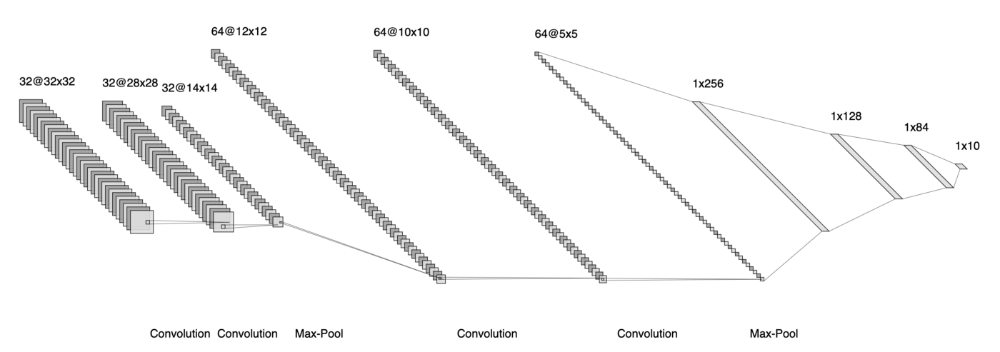
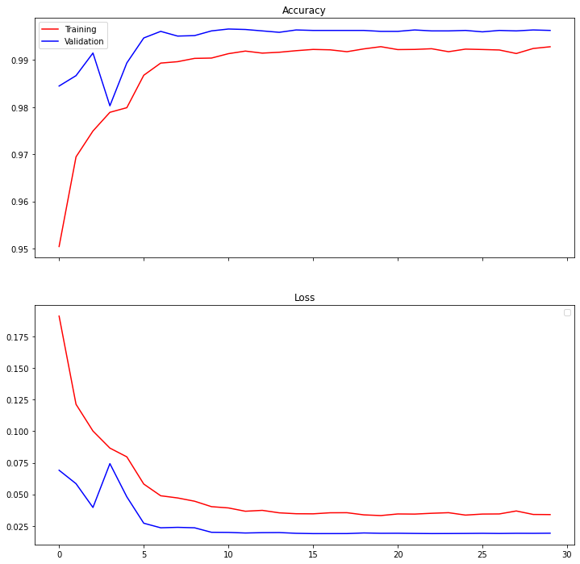
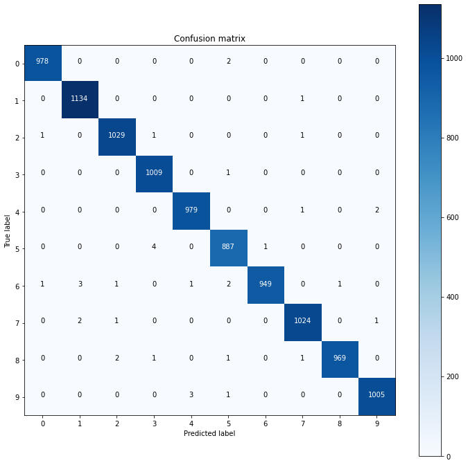
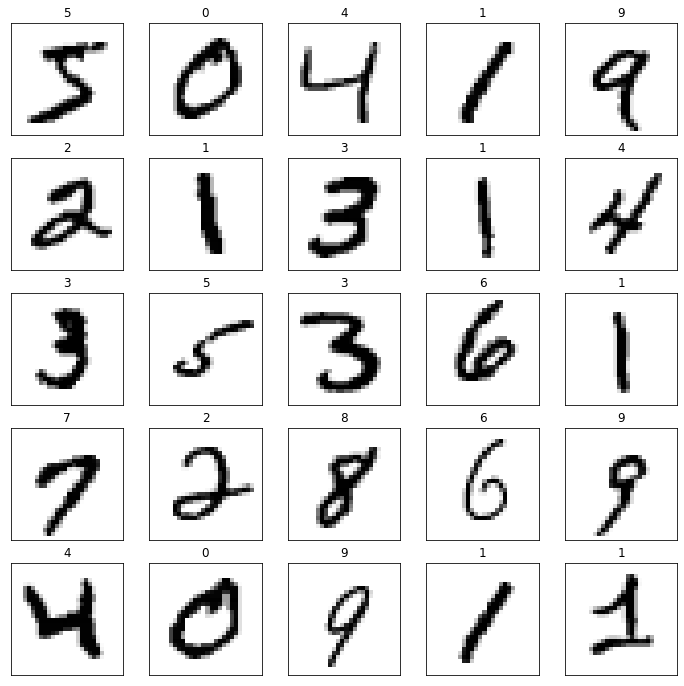

# Drawn Digit Recognition

[](https://github.com/turnerluke/digit_recog/actions/workflows/ci.yml)
[](https://www.python.org/downloads/release/python-3110/)
[](https://github.com/astral-sh/ruff)
[](LICENSE)

A web app that recognizes hand-drawn digits using a Keras convolutional neural network trained on the MNIST dataset. Draw a digit on the canvas and the model returns its prediction along with a bar chart of its confidence across all ten classes.

Built with [Streamlit](https://streamlit.io/), TensorFlow/Keras, OpenCV, and [Altair](https://altair-viz.github.io/), and deployed on [Streamlit Community Cloud](https://streamlit.io/cloud).

## Running locally

This project uses [`uv`](https://docs.astral.sh/uv/) for dependency management.

```bash
uv sync
uv run streamlit run streamlit_app/app.py
```

Then open the URL Streamlit prints (default <http://localhost:8501>).

## Data

The model is trained and validated on the Modified National Institute of Standards and Technology (MNIST) dataset of handwritten digits, obtained from `keras.datasets`:

```python
(X_train, y_train), (X_test, y_test) = keras.datasets.mnist.load_data()
```

The dataset consists of 60,000 training and 10,000 testing digits with their corresponding labels. Inputs are standardized to zero mean and unit standard deviation.

Data augmentation is applied during training to reduce overfitting, using the following random operations:

- 10 degree rotations
- 10% zoom
- 10% horizontal shifts
- 10% vertical shifts

## Model

The model is the LeNet-5 v2.0 convolutional neural network (CNN), originally presented in [LeCun et al., *Gradient-Based Learning Applied to Document Recognition*](http://vision.stanford.edu/cs598_spring07/papers/Lecun98.pdf).

The training notebook is available here:

[](https://colab.research.google.com/github/turnerluke/digit_recog/blob/main/models/LeNet_5_train.ipynb)



***Figure 1:** Model CNN visualization (created with [NN-SVG](http://alexlenail.me/NN-SVG/LeNet.html)).*

### Architecture

| Layer (type)                      | Output Shape       | Parameters |
| --------------------------------- | ------------------ | ---------- |
| Convolution_1 (Conv2D)            | (None, 28, 28, 32) | 832        |
| Convolution_2 (Conv2D)            | (None, 24, 24, 32) | 25,600     |
| Batchnorm_1 (BatchNormalization)  | (None, 24, 24, 32) | 128        |
| Activation_25 (Activation)        | (None, 24, 24, 32) | 0          |
| Max_pool_1 (MaxPooling2D)         | (None, 12, 12, 32) | 0          |
| Dropout_1 (Dropout)               | (None, 12, 12, 32) | 0          |
| Convolution_3 (Conv2D)            | (None, 10, 10, 64) | 18,496     |
| Convolution_4 (Conv2D)            | (None, 8, 8, 64)   | 36,864     |
| Batchnorm_2 (BatchNormalization)  | (None, 8, 8, 64)   | 256        |
| Activation_26 (Activation)        | (None, 8, 8, 64)   | 0          |
| Max_pool_2 (MaxPooling2D)         | (None, 4, 4, 64)   | 0          |
| Dropout_2 (Dropout)               | (None, 4, 4, 64)   | 0          |
| Flatten (Flatten)                 | (None, 1024)       | 0          |
| Fully_connected_1 (Dense)         | (None, 256)        | 262,144    |
| Batchnorm_3 (BatchNormalization)  | (None, 256)        | 1,024      |
| Activation_27 (Activation)        | (None, 256)        | 0          |
| Fully_connected_2 (Dense)         | (None, 128)        | 32,768     |
| Batchnorm_4 (BatchNormalization)  | (None, 128)        | 512        |
| Activation_28 (Activation)        | (None, 128)        | 0          |
| Fully_connected_3 (Dense)         | (None, 84)         | 10,752     |
| Batchnorm_5 (BatchNormalization)  | (None, 84)         | 336        |
| Activation_29 (Activation)        | (None, 84)         | 0          |
| Dropout_3 (Dropout)               | (None, 84)         | 0          |
| Output (Dense)                    | (None, 10)         | 850        |

## Training

The model was trained for 30 epochs with the Adam optimizer and categorical cross-entropy loss, using `ReduceLROnPlateau` to decay the learning rate, and data augmentation (rotation, zoom, and shifts) to reduce overfitting.

### Reproducing the model

`train.py` regenerates the model artifact and its serving constants from scratch:

```bash
uv run python train.py
```

It writes the model to `models/le_net5_v2.keras`, the normalization constants to `models/normalization.json`, and the run's metrics to `models/metrics.json`. A full run trains on CPU in a couple of hours; for a quick check, run a subset with `--epochs 1 --limit 2000 --output /tmp/smoke.keras` (this leaves the committed constants untouched).

## Performance

The model achieves a final accuracy of **99.63%** on the MNIST test set.



***Figure 2:** Training and validation loss and accuracy versus epoch.*



***Figure 3:** Confusion matrix on the MNIST test set.*

## Preprocessing

To match the data the model was trained on, each drawing is preprocessed the same way MNIST digits are: the stroke is isolated and cropped, size-normalized into a 20px box centered within a 28x28 frame by its center of mass, padded to 32x32, and standardized with the training set's mean and standard deviation (`models/normalization.json`). Because the digit is recentered and rescaled automatically, you can draw it at any size or position on the canvas.



***Figure 4:** Examples of MNIST digits the model recognizes well.*
